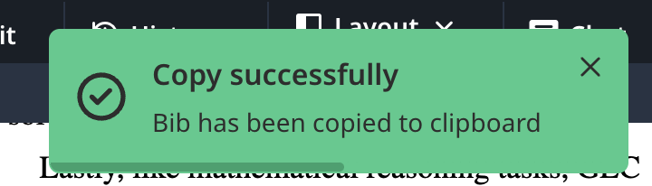

  
  <h1>Overleaf-Bib-Helper</h1>

  一个用户脚本，通过在Overleaf编辑器中直接从DBLP和Google Scholar搜索文章并获取BibTeX来增强Overleaf功能。

  
  
  
  
  
  
  

---

      <a href="#安装">安装</a> •
      <a href="#使用方法">使用方法</a> •
      <a href="#支持的来源">支持的来源</a> •
      <a href="#故障排除">故障排除</a> •
      <a href="#免责声明">免责声明</a> •
      <a href="#更新日志">更新日志</a> •
      <a href="#许可证">许可证</a> •
      <a href="#贡献">贡献</a> •
      <a href="#联系方式">联系方式</a> •
      <a href="#组织者">组织者</a> •
      <a href="#贡献者">贡献者</a> •
      <a href="#致谢">致谢</a>
    

## 动机
编写LaTeX文档通常需要包含大量的学术参考文献。手动搜索和格式化BibTeX条目可能非常耗时。Overleaf-Bib-Helper通过将DBLP和Google Scholar的搜索功能集成到Overleaf界面中，简化了这一过程，使用户能够快速找到并复制BibTeX条目，省时省力。

## 功能
- 在Overleaf中搜索DBLP或Google Scholar中的学术文章。
- 一键检索并复制BibTeX条目。
- 可配置的结果数量（5、10、20或50个结果）。
- 可滚动的结果列表，便于浏览。
- 键盘快捷键：Enter键搜索，Esc键关闭弹出窗口。
- 支持多个Google Scholar镜像以提高可访问性。

## 安装
### 第一步：安装Tampermonkey
Tampermonkey是一个运行Overleaf-Bib-Helper等用户脚本所需的浏览器扩展。按照以下步骤操作：
1. **下载Tampermonkey**：
   - **Chrome**：[Chrome网上商店](https://chrome.google.com/webstore/detail/tampermonkey/dhdgffkkebhmkfjojejmpbldmpobfkfo)
   - **Firefox**：[Mozilla插件](https://addons.mozilla.org/en-US/firefox/addon/tampermonkey/)
   - **Edge**：[Microsoft Edge插件](https://microsoftedge.microsoft.com/addons/detail/%E7%AF%A1%E6%94%B9%E7%8C%B4/iikmkjmpaadaobahmlepeloendndfphd)
   - **Safari**：[应用商店](https://apps.apple.com/us/app/tampermonkey/id1482490089)（需要macOS）
2. **启用Tampermonkey**：
   - 安装完成后，点击浏览器工具栏中的Tampermonkey图标，确保其已启用。
3. **启用插件的开发者模式**:
   - 以Chrome为例，你需要在浏览器的扩展程序页面（`chrome://extensions/`）中启用开发者模式。

### 第二步：安装Overleaf-Bib-Helper
您可以通过以下两种方式之一安装脚本：

#### 选项1：从Greasy Fork安装（推荐）
1. 访问[Greasy Fork页面](https://greasyfork.org/zh-CN/scripts/532304-overleaf-bib-helper)。
2. 点击**“安装此脚本”**按钮。
3. Tampermonkey将打开一个确认窗口。点击**“安装”**以添加脚本。
4. 脚本将在Overleaf项目页面（`https://www.overleaf.com/project/*`）上自动激活。
5. 为保持脚本更新，请在Tampermonkey设置中启用自动更新。

#### 选项2：从GitHub安装
1. 前往[GitHub仓库](https://github.com/MLNLP-World/Overleaf-Bib-Helper)。
2. 打开仓库中的`Overleaf-Bib-Helper.js`文件。
3. 复制整个脚本内容。
4. 在浏览器中，点击Tampermonkey图标 > **“创建新脚本”**。
5. 将复制的代码粘贴到编辑器中，替换默认模板。
6. 在Tampermonkey编辑器中点击**文件 > 保存**。
7. 脚本将在Overleaf项目页面上激活。
8. **注意**：对于从GitHub手动安装，请定期检查仓库更新并根据需要重新安装。

## 使用方法
### 打开工具
1. 在浏览器中打开Overleaf项目（`https://www.overleaf.com/project/*`）。
2. 在Overleaf工具栏中查找一个新图标（类似小文档的图标）。
3. 点击该图标以打开搜索弹出窗口。

### 搜索文章
1. **输入查询**：在输入字段中键入搜索词（例如文章标题、作者或关键词）。
2. **选择来源**：从“来源”下拉菜单中选择“DBLP”或“Google Scholar”。
   - **DBLP**：最适合计算机科学文献，提供结构化数据。
   - **Google Scholar**：覆盖更广泛的领域，但可能需要验证码验证。
3. **设置结果数量**：从“结果”下拉菜单中选择5、10、20或50个结果。
4. **开始搜索**：
   - 按下**Enter**键或点击放大镜图标。
5. 结果将显示在输入字段下方的可滚动列表中。

### 复制BibTeX
1. 点击列表中的任何结果（例如“标题@作者”）。
2. BibTeX条目将被复制到剪贴板。
3. 将显示通知确认成功（“复制成功”）或报告错误（“复制失败”）。

### 关闭弹出窗口
- 按下**Esc**键或再次点击工具栏图标。

## 支持的来源
- **DBLP**：一个全面的计算机科学书目数据库，提供可靠的BibTeX条目。
- **Google Scholar**：一个更广泛的学术搜索引擎，可能包括更多最新或跨学科的作品，但可能需要用户验证（例如验证码）。

## 故障排除
- **脚本不起作用？**
  - 确保浏览器已经对扩展启用了**开发者模式**。
  - 确保Tampermonkey已启用且脚本处于活动状态。
  - 确认您在Overleaf项目页面上。
  - 重新加载或从Greasy Fork重新安装。
- **没有结果？**
  - 检查查询是否有拼写错误。
  - 确保你对插件搜索权限进行了授权。
  - 尝试在DBLP和Google Scholar之间切换。
- **Google Scholar问题？**
  - 如果验证码阻止访问，请在打开的标签中完成验证并重试。

## 免责声明
虽然Overleaf-Bib-Helper旨在提供无缝体验，但请注意，它依赖于外部服务（DBLP和Google Scholar），这些服务的API可能会更改或需要用户验证（例如验证码）。请自行决定使用此工具，并始终在将检索到的BibTeX条目纳入文档前进行验证。

## 更新日志
- **2025-04-10**：增加了对 cn.overleaf.com 和 cn.overleaf.com 域的支持（v1.2）。
- **2025-04-09**：初始版本，支持DBLP和Google Scholar的基本功能（v1.1）。

## 许可证
此项目采用MIT许可证 - 详情见[LICENSE.md](https://github.com/MLNLP-World/Overleaf-Bib-Helper/blob/main/LICENSE.md)。

## 贡献
欢迎分叉[GitHub仓库](https://github.com/MLNLP-World/Overleaf-Bib-Helper)，提交问题或创建改进的拉取请求！

## 联系方式
如有任何问题或建议，请发送电子邮件至[Xunjian Yin](mailto:xjyin@pku.edu.cn)或在此处创建Github问题。

## 组织者

## 贡献者

## 致谢
灵感来源于类似工具和学术界对高效参考管理的需要。